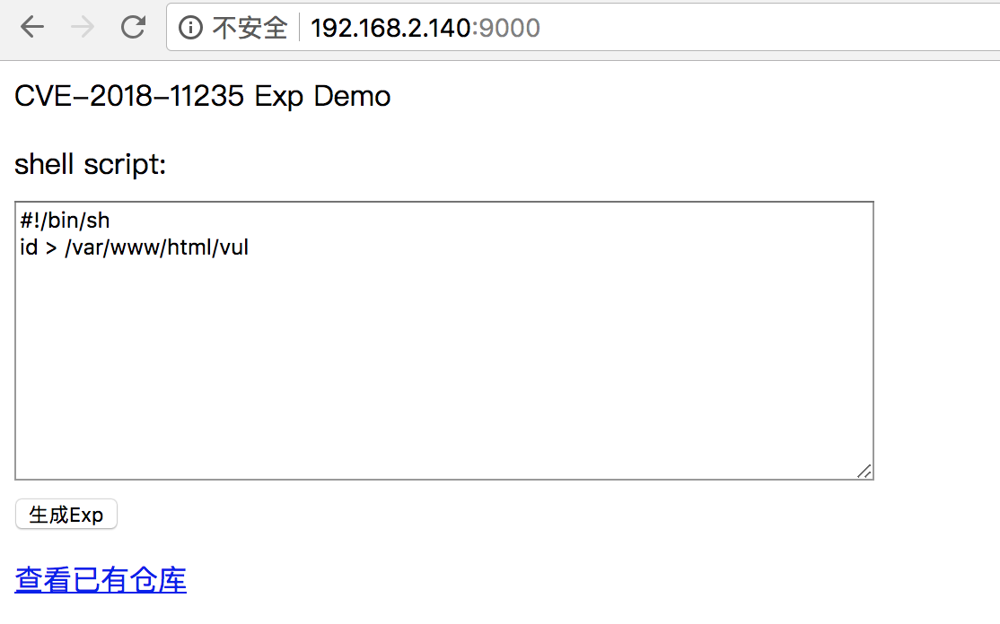
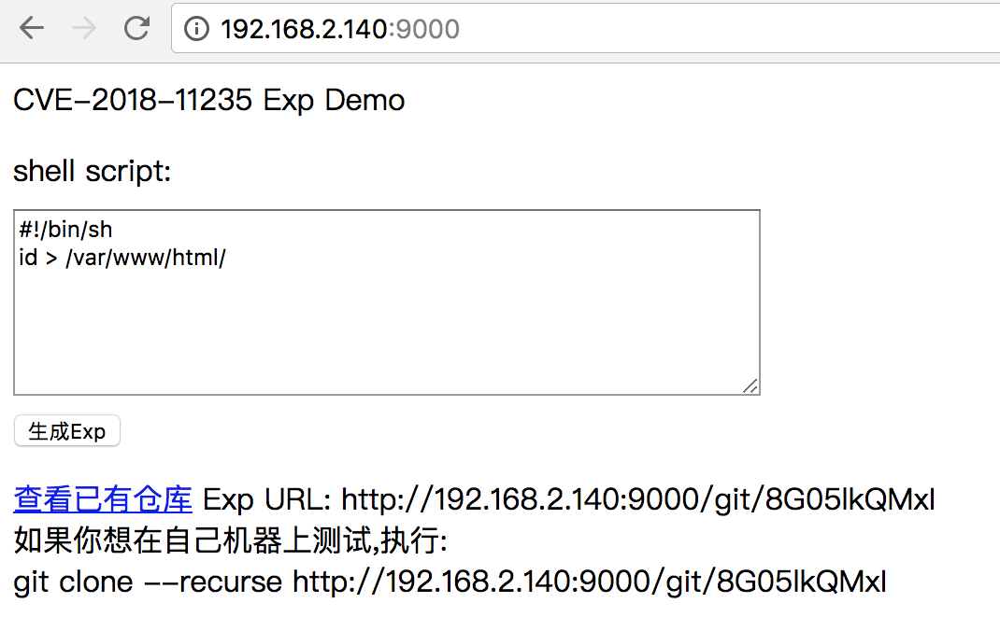

## Git远程代码执行漏洞(CVE-2018-11235)

### 漏洞信息

近日，微软 Visual Studio 团队项目经理 Edward Thomson 在其博客中对外披露，Git 社区最近发现了一个严重漏洞，Git 子模块在解析时可能导致`git clone --recursive`执行任意命令。

Git 和众多提供 Git 托管服务的公司都开始安装相关补丁程序，用以修补 Git 源码版本控制系统的一个危险漏洞。该补丁程序将包含在 Git 2.17.1 中，主要修补了两个安全漏洞 CVE-2018-11233 和 CVE-2018-11235。

### 影响范围

* Git < 2.17.1

### 镜像信息

#### Vul 镜像

该镜像模拟的是一个可在线 clone git 仓库的 web 界面，通过接收用户输入 URL, 将远程仓库 clone 到本地。在此例中充当受害者服务。

类型 | 值
:-:|:-:
Git | 1.9.1-1
HTTP 端口 | 80
镜像 tag | g_git_1

#### Exp 镜像

该镜像提供了 git web 服务，可生成带有攻击脚本的仓库，在此例中充当攻击者服务。

类型 | 值
:-:|:-:
Git | 1.9.1-1
HTTP 端口 | 80
镜像 tag | g_git_1_exp

### 获取环境:

 ```
$ docker-compose up -d
 ```

 访问 http://127.0.0.1:8000 和 http://127.0.0.1:9000 检验是否成功启动
 
 **注意，exp 镜像请不要直接通过 127.0.0.1 来访问，请使用物理机的 IP 加端口的方式来访问**

### 使用步骤

**注意：GitHub 和微软（通过 Visual Studio Team Services）的 Git 托管服务已经部署了这些补丁，所以在本例中，我们通过 Exp镜像来作为远程代码托管服务器，Vul镜像作为受害者。** 

> 假定物理机的 IP 地址为: 192.168.2.140
> 
> Exp 镜像开启在 9000 端口(http://192.168.2.140:9000)
> 
> Vul 镜像开启在 8000 端口(http://192.168.2.140:8000)

1. 启动 Exp 容器,如果之前已经启动,可跳过此步骤

 ```
$ docker run -d -p 9000:80 medicean/vulapps:g_git_1_exp
 ```

2. 访问 http://192.168.2.140:9000, 生成 Exp 仓库

 
 
 本例中是在目标系统上执行 id 命令，并将其结果输出到目标系统的 /var/www/html/vul 文件中, 当然，也可以直接反弹 shell.
 
 ```
 #!/bin/sh
id > /var/www/html/vul
 ```
 然后点击「生成Exp」按钮,会生成 Exp 仓库地址：

 


3. 启动 Vul 容器，如果之前已经启动,可跳过此步骤

 ```
$ docker run -d -p 8000:80 medicean/vulapps:g_git_1
 ```

4. 访问 http://192.168.2.140:8000, 在输出框中填入 Exp Url 的地址,然后提交

 

5. 结合上面的 exp, 访问 http://192.168.2.140:8000/vul 可看到执行结果

 

### 相关链接

* [Git爆远程代码执行漏洞，建议尽快升级](https://mp.weixin.qq.com/s/2TitRx1iGnKgqpYzLqA14w)
* [Upgrading git for the May 2018 Security Release](https://www.edwardthomson.com/blog/upgrading_git_for_cve2018_11235.html)
* [Rogdham/CVE-2018-11235](https://github.com/Rogdham/CVE-2018-11235)
